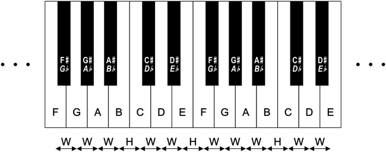

# Copying 

Steve Jobs once said that good artists copy and great artists steal. It is actually an art to even know what is worth copying or stealing in my opinion. When you have an eye for what is great about an artwork and you are able to take it somewhere else that is art. If I look at it froma different point of view than a graphic designer but a songwritter. You have 12 notes in different octaves but every music is made out of maximum 12 notes. No more. Therefor every music is made out of almost exactly the same tones or chords yet it can be so different every time and make you feel completly different feelings and expirience new kind of genius.

 

In conclusion copying is how we make great art because to do something completely original is super rare. It happens one or twice in a life time if ever. If the copying or stealing is bringing something new then I think it is fine.

# Voice and Tone

## Writing Style

- My intention is to write as honest as possible with a little twist of some originality in my tone or way of expressing myself. While also describing the subject as clear as possible.

## Voice

- Honest
- Original
- Friendly
- Kind of fun (bring some dynamics)

## Tone

- I want to make you laugh but stop trying to be funny
- Connect with anyone on some level
- Make you interested
- Not use the same phrases
- But repeat what is important 
