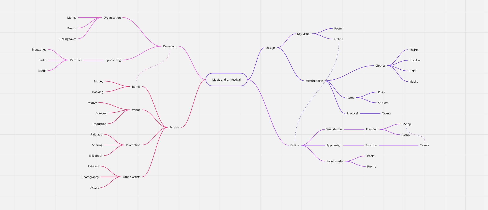

# Hladova Opona Festival
The Hladova Opona festival is a music festival that is supposed to support the local culture and their artists. Even though the main program is music the supporting program focuses on other art forms like photography, paintings ect.

  
Mind Map

  
  
  

  
### Voice and tone
- Voice: Informal, Entertaining, Profesional
- Tone: Friendly, Saticric, Peer

### Outline
- Printed graphics
- Web graphics
- Social Media Content
- Merch
- Event

### Keywords
- Culture
- Music
- Artists
- United visual style
- Event marketing
- Covid
- Entertainment
